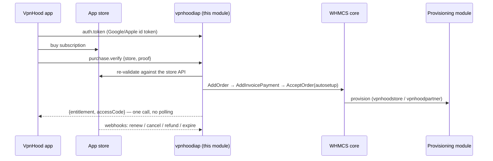

# VpnHood.WHMCS.Iap

**WHMCS addon module (`vpnhoodiap`) that turns app-store purchases into real WHMCS
orders — and delivers VpnHood access codes through the install's own provisioning
module.**

Supported stores: **Google Play** (first), **Apple App Store** and **Microsoft Store**
(planned). The store remains the merchant of record; WHMCS becomes the single system of
record for customers, orders, invoices, renewals and refunds.

> ⚠️ **Status: in development.** The module skeleton (admin UI, tables, fail-closed
> endpoints) is complete; the Google Play purchase pipeline is being built.

## How it works



1. **Sign-in** — the app posts a Google/Apple id token to `api.php` (`auth.token`); the
   module creates or links a WHMCS client by email (verified emails only) and returns an
   opaque session token.
2. **Purchase** — the app buys in the store and posts its proof (`purchase.verify`); the
   module re-validates against the store API, then uses **only WHMCS-native machinery**:
   `AddOrder` on the mapped product → `AddInvoicePayment` (transid = store order id) →
   `AcceptOrder(autosetup)`. WHMCS itself runs whatever provisioning module the product
   uses; the access code is read back from the service and returned synchronously.
3. **Lifecycle** — store webhooks (`webhook.php`) drive renewals, cancellations and
   refunds through the same WHMCS-native paths (pay renewal invoice / `ModuleSuspend` /
   `ModuleTerminate`).

## Provisioning-agnostic by design

The module ships **verbatim** inside two packages:

| Package | Mapped products use | Delivery |
| --- | --- | --- |
| **Hub** ([VpnHood.WHMCS]) — VpnHood's own WHMCS | `vpnhoodstore` | access code fetched live from the access manager |
| **Partner** ([VpnHood.WHMCS.Partner]) — white-label partners with their own store apps | `vpnhoodpartner` | access code relayed from the hub, stored on the service |

The module never talks to the VpnHood access server or the hub API, and has no code
dependency on `vpnhoodstore` or `vpnhoodpartner` — but a mapped product backed by one of
them must exist, or orders would provision nothing.

Because the same code runs on every install, the repo carries its **own version stream**
(`./VERSION`): WHMCS decides whether to run `_upgrade()` by comparing the version in
`vpnhoodiap_config()`, so the same code must carry the same number everywhere. Consuming
packages copy the module verbatim and never restamp it.

## Security posture

- **Fail closed** — `api.php` and `webhook.php` answer 404 while the addon is inactive.
- **Two-layer webhook auth** — a secret path token *and* the store-native proof
  (Google Pub/Sub OIDC JWT / Apple JWS); notification bodies are treated as pointers
  only — entitlement always comes from re-fetching the purchase from the store API.
- **Never acknowledge before provisioning succeeds** — Google auto-refunds
  unacknowledged purchases, which is the customer's fail-safe.
- **Store credentials** are stored encrypted (WHMCS `EncryptPassword`) and are
  write-only in the admin UI. Purchase tokens are never returned to clients.
- The module writes only to its own `mod_vpnhood_iap_*` tables; WHMCS core data is
  touched exclusively through `localAPI`.

## Layout

```text
modules/addons/vpnhoodiap/          the addon: admin UI, tables, api.php, webhook.php
modules/gateways/vpnhoodiappay.php     bookkeeping gateway (store is the merchant of record)
includes/hooks/vpnhoodiap-suppress-emails.php   aborts WHMCS invoice mail for store-paid invoices
scripts/set-version.sh              propagate ./VERSION into the module
scripts/test-dev.sh                 run the test suites against the dev WHMCS
tests/unit/                         dependency-free unit tests (pure PHP, no WHMCS)
tests/integration/                  *.test.php run inside the dev WHMCS over SSH
```

Everything extracts at the WHMCS root.

## Requirements

- WHMCS 8.x / 9.x, PHP 8.1+.
- The addon activated (until then the public endpoints answer 404).
- WHMCS **email verification enabled** (`EnableEmailVerification`) — the module refuses
  to attach purchases to unverified existing emails.
- The bookkeeping gateway `vpnhoodiappay` activated but **never shown on the order form**.
- Products for each sellable plan, using `vpnhoodstore` (hub) or `vpnhoodpartner`
  (partner), mapped in the addon's **Catalog** tab.
- Per store app: the store credentials (Google service-account JSON, Apple keys, …)
  entered in the addon's **Apps** tab.

## Development & testing

The dev WHMCS and its deploy tooling live in the sibling [VpnHood.WHMCS] repo:

```bash
# from the VpnHood.WHMCS repo — deploys THIS repo's working tree to the dev WHMCS
scripts/deploy-dev.sh iap

# from THIS repo — run unit + integration suites on the dev WHMCS
scripts/test-dev.sh all
```

(`IAP_REPO` overrides the default sibling path.) Unit tests are pure PHP with no WHMCS
or Composer dependency; integration tests are uploaded over SSH and run inside the real
dev install, asserting through `localAPI` reads.

## Related repositories

| Repo | Role |
| --- | --- |
| [VpnHood] | The VPN client/server and app libraries (the "Portal API" client lives here) |
| [VpnHood.WHMCS] | Hub WHMCS modules: `vpnhoodstore` provisioning, partner hub |
| [VpnHood.WHMCS.Partner] | Partner connector module (`vpnhoodpartner`) |

## License

[LGPL-2.1](LICENSE) — same license as the main [VpnHood] project.

[VpnHood]: https://github.com/vpnhood/VpnHood
[VpnHood.WHMCS]: https://github.com/vpnhood/VpnHood.WHMCS
[VpnHood.WHMCS.Partner]: https://github.com/vpnhood/VpnHood.WHMCS.Partner
